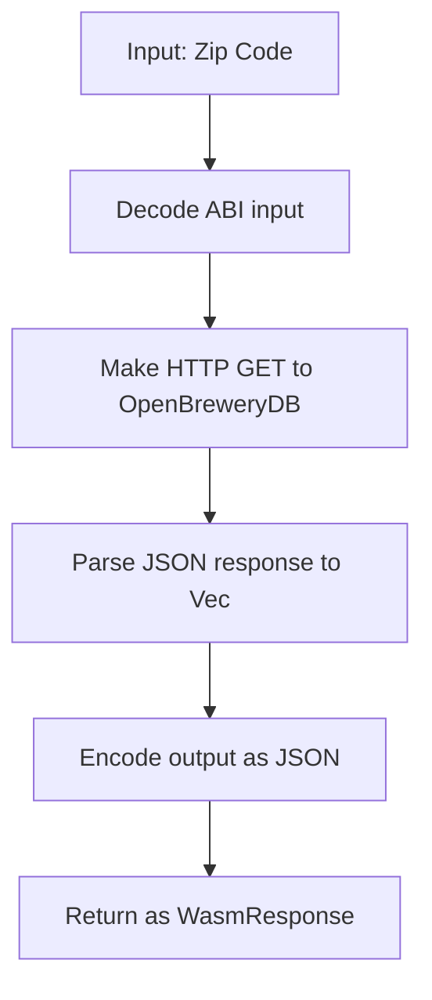

# Brewery Lookup Component Plan

## Overview
This component takes a US zip code as input, queries the OpenBreweryDB API, and returns a list of breweries in that area. The component is designed for WAVS and will be built to pass all validation checks.

- **Input:** Zip code (string, e.g., "92101")
- **Output:** JSON array of breweries (name, type, address, etc.)
- **API Used:** https://api.openbrewerydb.org/v1/breweries?by_postal=<ZIP>&per_page=3

## Validation Checklist
- [x] ALWAYS use `{ workspace = true }` in Cargo.toml
- [x] ALWAYS verify API response structures by using curl/websearch
- [x] ALWAYS read documentation and rules
- [x] ALWAYS implement the Guest trait and export the component
- [x] ALWAYS use `export!(Component with_types_in bindings)`
- [x] ALWAYS use `clone()` before consuming data to avoid ownership issues
- [x] ALWAYS derive `Clone` for API response data structures
- [x] ALWAYS decode ABI data properly, never with `String::from_utf8`
- [x] ALWAYS use `ok_or_else()` for Option types, `map_err()` for Result types
- [x] ALWAYS use string parameters for CLI testing
- [x] ALWAYS use `.to_string()` for string literals in struct assignments
- [x] NEVER edit bindings.rs
- [x] Implements Guest trait
- [x] Exports component correctly
- [x] Properly handles TriggerAction and TriggerData
- [x] Properly decodes function calls
- [x] Avoids String::from_utf8 on ABI data
- [x] All API structures derive Clone
- [x] Clones data before use
- [x] Avoids moving out of collections
- [x] Avoids all ownership issues
- [x] Uses ok_or_else() for Option types
- [x] Uses map_err() for Result types
- [x] Provides descriptive error messages
- [x] Includes all required traits and types
- [x] Uses correct import paths
- [x] Properly imports SolCall for encoding
- [x] All dependencies are in Cargo.toml with `{workspace = true}`
- [x] Any unused imports are removed
- [x] Uses proper sol! macro with correct syntax
- [x] Correctly defines Solidity types in solidity module
- [x] Implements required functions
- [x] No hardcoded API keys or secrets
- [x] Uses environment variables for sensitive data (not needed for this public API)
- [x] Uses workspace dependencies correctly
- [x] Includes all required dependencies
- [x] Properly imports sol macro
- [x] Uses solidity module correctly
- [x] Handles numeric conversions safely
- [x] Uses .to_string() for all string literals in struct initialization
- [x] Uses block_on for async functions
- [x] Uses fetch_json with correct headers
- [x] API endpoint tested with curl/websearch
- [x] Always use #[serde(default)] and Option<T> for fields from external APIs

## Imports Needed
- `serde::{Deserialize, Serialize}`
- `wavs_wasi_utils::http::{fetch_json, http_request_get}`
- `wstd::{http::HeaderValue, runtime::block_on}`
- `alloy_sol_types::{SolValue}`
- `wavs_wasi_utils::evm::alloy_primitives::hex`
- `anyhow::Result`
- `crate::bindings::{export, Guest, TriggerAction, WasmResponse}`
- `trigger::{decode_trigger_event, encode_trigger_output, Destination}`

## API Response Structure
From websearch/curl:
```
[
  {"id":"...","name":"10 Barrel Brewing Co","brewery_type":"large","address_1":"1501 E St",...},
  ...
]
```
Fields: id, name, brewery_type, address_1, city, state_province, postal_code, country, longitude, latitude, phone, website_url, etc.

## Data Structures
- Brewery: derive Serialize, Deserialize, Clone, Default; all fields Option<T> with #[serde(default)]
- Result: Vec<Brewery>

## Flow Chart


## Special Considerations
- All API fields are Option<T> with #[serde(default)] for robustness
- No API key needed (public API)
- Use proper error handling for HTTP/network/JSON errors
- Use block_on for async HTTP
- No sensitive data or secrets
- Output is always JSON array of breweries 
